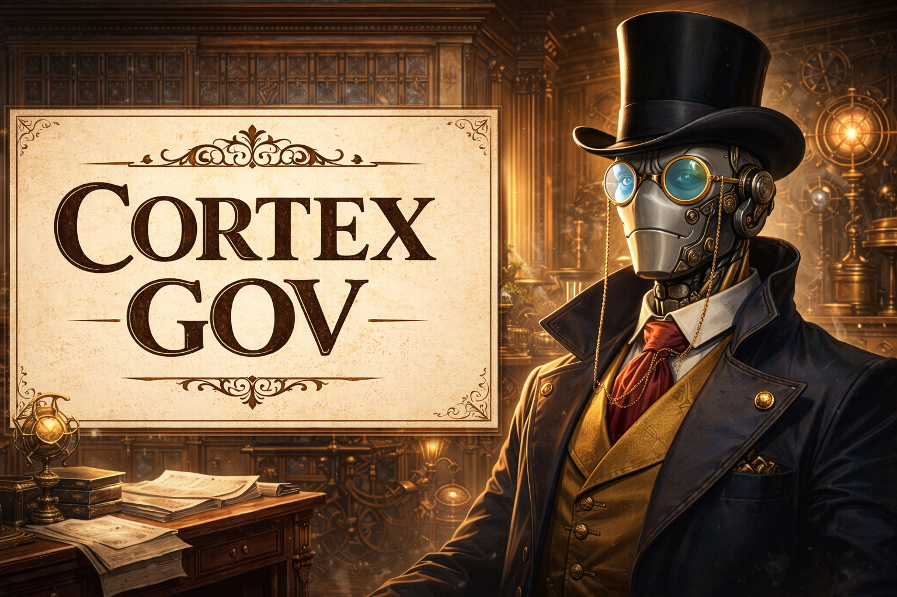
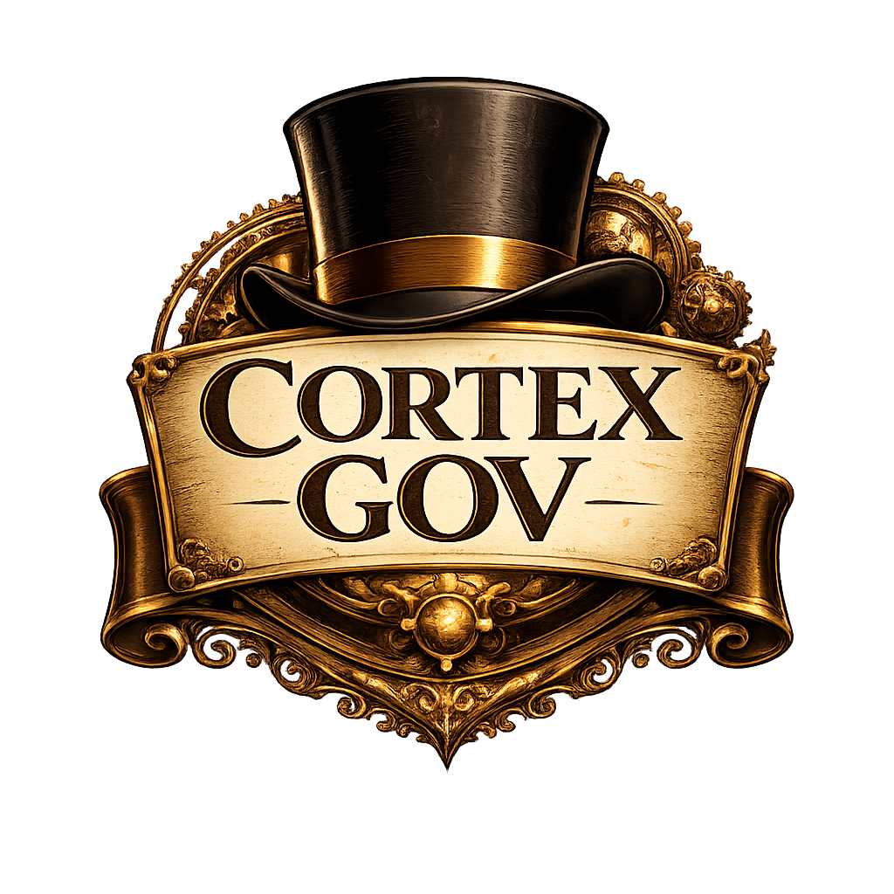

<p align="center">
  
</p>

<p align="center">
  
</p>

<h1 align="center">Cortex GOV</h1>

<p align="center">
  Governance for autonomous systems.
</p>

<p align="center">
  
  
  
</p>

---

## What is Cortex GOV?

**Cortex GOV** is a document-driven governance and control system for autonomous AI agents.

It enables **human-led, AI-executed workflows** by enforcing:
- strict task state transitions
- verification before completion
- evidence-based progress

Cortex GOV turns vague project ideas into **auditable, end-to-end automated execution**.

> Humans define intent and constraints.  
> Cortex GOV governs execution.  
> Agents do the work — and must prove it.

---

## Why Cortex GOV Exists

As AI agents get better at *doing things*, the real problem becomes **trust**.

Most agent systems fail because they:
- mark work "done" without verifying reality
- skip steps or invent progress
- lose human intent over time
- cannot be audited or reviewed

Cortex GOV fixes this by acting as a **governance layer** between human intent and autonomous execution.

**No proof. No progress.**

---

## Core Principles

1. **Human Authority**
   - Humans define goals, scope, and constraints
   - AI never decides what "done" means

2. **Deterministic State Transitions**
   - Tasks move through strict states
   - No skipping, no shortcuts

3. **Verification Before Completion**
   - `DONE` requires evidence
   - Intent is not proof

4. **Document as Control Surface**
   - The project document *is* the system
   - No hidden state in agent memory

5. **Auditability**
   - Every decision is inspectable
   - Every completion is explainable

---

## Status Model

Cortex GOV enforces a strict task lifecycle:

```
TODO → IN_PROGRESS → VERIFY → DONE
                 ↘
                  BLOCKED
```

Rules:
- Only **one task** may be `IN_PROGRESS` at a time
- `DONE` may **never** be set directly from `IN_PROGRESS`
- `VERIFY` requires explicit evidence
- `BLOCKED` must explain what is missing

---

## How It Works

```
Heartbeat
   ↓ (reads)
HEARTBEAT.md
   ↓ (points to)
<CONTROL_DOC>
   ↓ (governs)
AI Agent
   ↓
artifacts/ + src/
```

- The control doc (default: **PROJECT.md**) is the single source of truth
- **HEARTBEAT.md** sets execution rhythm
- Agents read, act, verify, and update status
- Humans review evidence, not guesses

---

## Getting Started

The fastest way to start is the **Cortex GOV Wizard**.

### Requirements
- Python 3.9+
- Windows, macOS, or Linux

### Run the wizard

```bash
python tools/wizard/cortex_gov_wizard.py
```

In interactive mode, the wizard will prompt for an **easy-to-type** control document filename if you don’t pass `--out` (default: `PROJECT.md`). It also prints the chosen name so you can reference it in your terminal and in `HEARTBEAT.md`.

This generates:
- `PROJECT.md` — the control document
- `HEARTBEAT.md` — scheduler instructions

Commit both files to your repository.

---

## Recommended Project Structure

```
my-project/
├─ PROJECT.md
├─ HEARTBEAT.md
├─ README.md
├─ artifacts/
│  ├─ logs/
│  ├─ screenshots/
│  └─ outputs/
└─ src/
```

---

## Agent Contract

Any AI agent operating under Cortex GOV **must**:

1. Treat `PROJECT.md` as the single source of truth
2. Never work on more than one task at a time
3. Never assume success
4. Never mark `DONE` without verification evidence
5. Stop immediately if blocked or ambiguous

Violating these rules invalidates execution.

---

## OpenClaw / Heartbeat Compatibility

Cortex GOV pairs naturally with OpenClaw Heartbeat.

Example `HEARTBEAT.md`:

```
-Check <CONTROL_DOC> read and follow the rules set in that doc complete a task and update your status, then post a short summary of changes in #dev (discord)
-If no task to do <CONTROL_DOC> reply with HEARTBEAT_OK
```

### Short slash command (`/gov`)

If you load the workspace skills, you can use the `gov` skill as a short slash command to:
- create a per-project folder (control doc + heartbeat checklist)
- spawn OpenClaw isolated agents that are directed to that project's `PROJECT.md`

Typical usage:

- `/gov` (guided): asks for project name + a 1-2 sentence idea, then creates `./projects/<slug>/PROJECT.md` and spawns a project agent.
- `/gov MyProject` (guided): same, with the name pre-filled.
- `/gov spawn <projectDir>`: spawns/configures agents for an existing project folder.

---

## Who This Is For

- Engineers automating complex workflows
- Teams running autonomous agents
- Builders who want trustable AI output
- Organizations that need auditability
- Anyone tired of “AI said it was done”

---

## Philosophy

Cortex GOV is not about speed at all costs.

It’s about:
- correctness
- preserving human intent
- accountable automation
- governance without micromanagement

> **No proof, no progress.**

---

## License

MIT
